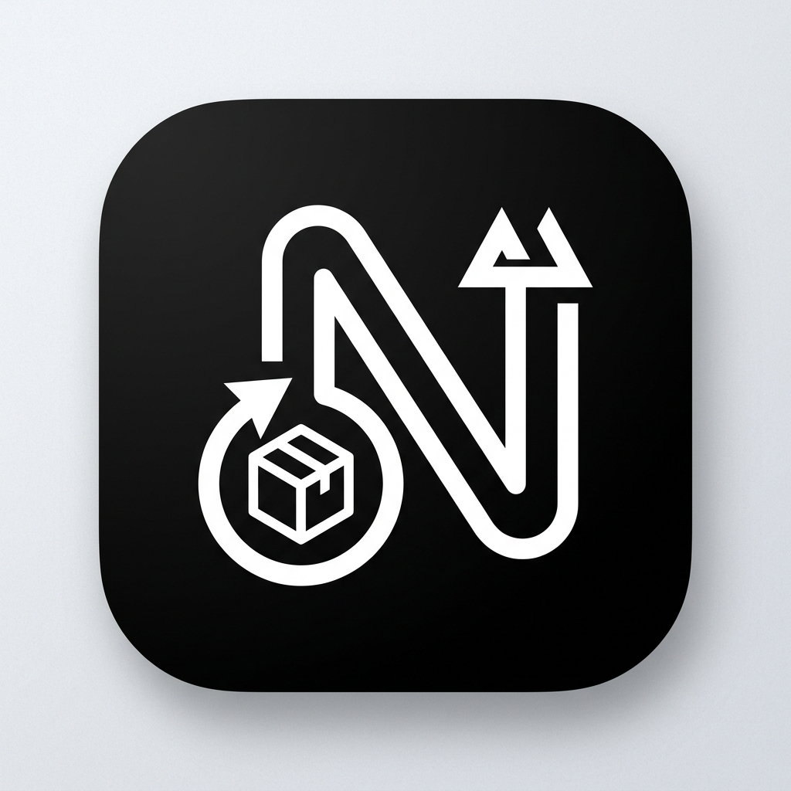

# Niruvi Store

<div align="center">



**The Decentralized, Free, Open-Source Linux Application Marketplace for AppImages**

[](https://github.com/putinservai-cyber/niruvi-store/actions/workflows/validate.yml)
[](https://niruvi-store.runs-on.dev/)
[](https://www.gnu.org/licenses/gpl-3.0)
[](https://appimage.org/)

[**Live Web Store (`niruvi-store.runs-on.dev`)**](https://niruvi-store.runs-on.dev/) • [**Niruvi Desktop Manager**](https://github.com/putinservai-cyber/niruvi) • [**Submit Application**](CONTRIBUTING.md) • [**Support on Ko-fi**](https://ko-fi.com/putinservai)

</div>

---

## 🌟 What is Niruvi Store?

**Niruvi Store** is a 100% free, community-governed open-source Linux software store designed specifically for the **AppImage** packaging ecosystem.

Traditional Linux package managers require root privileges, complex PPA repositories, or heavy background runtimes. Niruvi Store empowers users to discover, verify, and run self-contained Linux applications with zero friction, zero telemetry, and zero cost.

### Core Pillars

- 🐧 **AppImage-First**: Purpose-built for standalone Linux binaries that run without installation across any modern distribution (Ubuntu, Debian, Fedora, Arch, openSUSE, Alpine).
- 🛡️ **Cryptographic Verification**: Native SHA-256 checksum tracking with in-browser hash verification tools to protect users against binary tampering.
- ⚡ **Zero-Cost $0 Infrastructure**: Hosted entirely on **GitHub Pages**, with downloads served directly from upstream **GitHub Releases** and metadata stored in human-readable JSON files.
- 🔗 **Niruvi Protocol Integration**: Directly triggers one-click downloads and sandbox management via `niruvi://install?...` protocol in the companion [Niruvi](https://github.com/putinservai-cyber/niruvi) desktop manager.
- 🤝 **Decentralized Contributions**: Adding a new application requires only a single JSON file in `catalog/apps/<name>.json`—no database access, no backend approval servers, no proprietary gatekeepers.

---

## 🏗️ Architecture

Niruvi Store runs seamlessly both as a **Cloudflare Worker with D1, KV, and Cron Triggers** (`src/worker.ts` + `wrangler.json`) and as a **pre-rendered static build** (`npm run build`):

```text
GitHub Repository (putinservai-cyber/niruvi-store)
 ├── React 18 + TypeScript + Tailwind v4 CSS (Vite SPA + Pre-rendered Static Routes)
 ├── Curated SHA-256 Verified Catalog (catalog/apps/*.json + public/catalog.json)
 ├── AppImageHub + GitHub Releases Data Pipeline (src/utils/appimagehub.ts)
 ├── Cloudflare Worker API + Scheduled Cron Handler (src/worker.ts & wrangler.json)
 ├── Cloudflare D1 SQL Schema Migrations (migrations/0001_catalog_pipeline.sql)
 ├── Automated Pre-rendering & Sitemap Generator (scripts/generate-catalog.ts, scripts/prerender-static.ts)
 └── Vitest Unit, Accessibility (axe-core), & Pipeline Test Suite (tests/*)
```

### Automated AppImageHub + GitHub Releases Pipeline (`src/utils/appimagehub.ts` & `src/worker.ts`)
1. **AppImageHub Feed Ingestion**: Fetches `https://appimage.github.io/feed.json` (version 1; 2,500+ Linux AppImages) and normalizes each package into Niruvi's schema (`id`, `name`, `description`, `categories`, `icon`, `screenshots`, `license`, `homepage`, `github_repo`), mapping desktop categories into 8 simplified categories (`Internet`, `Games`, `Graphics`, `Audio/Video`, `Office`, `Development`, `System/Utilities`, `Education`).
2. **GitHub Releases Enrichment**: For GitHub-hosted repositories, queries `https://api.github.com/repos/{owner}/{repo}/releases` using `env.GITHUB_TOKEN` (with KV caching and rate-limit guards) to extract `.AppImage` assets per architecture (`x86_64`, `aarch64`, `armhf`), file sizes, publication dates, release notes, and multi-version history.
3. **Strict SHA-256 Verification**: Checks native GitHub release asset digests (`sha256:...`), published `.sha256` / `SHA256SUMS` release assets, or computes SHA-256 via Web Crypto (`crypto.subtle.digest('SHA-256', ...)`). An application is marked **Verified** **only** when a real 64-character hex SHA-256 digest is confirmed.
4. **Cloudflare D1 + Cron Trigger (`0 */6 * * *`)**: The Worker's `scheduled()` handler runs every 6 hours, idempotently upserting packages into D1 (`catalog_apps`, `catalog_releases`) and logging per-app errors to `catalog_sync_logs` without stopping the batch.

---

## ☁️ Instant Community Submissions (Cloudflare Worker + D1 + Turnstile)

Niruvi Store supports instant community AppImage submissions via a dedicated Cloudflare Worker and D1 database in `/worker`:

- **Worker Config & Code**: `worker/wrangler.toml`, `worker/src/index.ts`, `worker/src/config.ts`
- **D1 Schema Migration**: `worker/migrations/0001_submissions.sql` (`submissions` and `submission_reports` tables)
- **Strict CORS Policy**: Allows only `https://putinservai-cyber.github.io` and `https://niruvi-store.runs-on.dev`.
- **Parameterized SQL & Sanitization**: Uses `.prepare(...).bind(...)` exclusively, hashes client IPs (`SHA-256` with `IP_HASH_SALT`), escapes all user text, enforces host allowlists (`github.com`, `gitlab.com`, `sourceforge.net`, etc.), and never downloads or executes submitted binaries.

### Worker API Endpoints

| Endpoint | Description |
| :--- | :--- |
| `GET /api/apps` | Returns all `published` community submissions ordered by `created_at DESC`. |
| `POST /api/submit` | Validates HTTPS URLs, allowed hosts, field length limits, slug uniqueness, static catalog duplicates, Cloudflare Turnstile token, and per-IP rate limits; inserts as `"published"`. |
| `POST /api/report` | Lets visitors report broken or abusive entries (rate-limited per IP hash). |
| `GET /api/admin/submissions` | Lists all submissions (`published` & `hidden`) and reports (`Authorization: Bearer <ADMIN_TOKEN>`). |
| `POST /api/admin/hide` | Hides or re-publishes a submission by `id` or `slug` (`Authorization: Bearer <ADMIN_TOKEN>`). |
| `POST /api/admin/delete` | Permanently deletes a submission by `id` or `slug` (`Authorization: Bearer <ADMIN_TOKEN>`). |

### Ordered Manual Setup Checklist (Cloudflare & GitHub)

```bash
# 1. Create the Cloudflare D1 database
cd worker
npx wrangler d1 create niruvi-store-db
# Copy the returned `database_id` UUID into `worker/wrangler.toml` under [[d1_databases]]

# 2. Apply the D1 schema migration (local & remote)
npx wrangler d1 migrations apply niruvi-store-db --local
npx wrangler d1 migrations apply niruvi-store-db --remote

# 3. Create a Cloudflare Turnstile widget in the Cloudflare Dashboard
#    Add hostnames: putinservai-cyber.github.io and niruvi-store.runs-on.dev
#    Copy the Site Key (for GitHub Actions vars) and Secret Key (for Worker secrets)

# 4. Set the Cloudflare Worker secrets (never commit secrets to the repo)
npx wrangler secret put TURNSTILE_SECRET_KEY
npx wrangler secret put ADMIN_TOKEN
npx wrangler secret put IP_HASH_SALT

# 5. Deploy the Cloudflare Worker
npx wrangler deploy

# 6. Set GitHub Repository Variables (Settings → Secrets and variables → Actions → Variables)
#    - VITE_API_URL            = https://niruvi-store-api.<your-subdomain>.workers.dev
#    - VITE_TURNSTILE_SITE_KEY = <your-turnstile-site-key>
#    - VITE_BASE               = /niruvi-store/ (for github.io) or / (for custom domain)
#    - VITE_SITE_URL           = https://putinservai-cyber.github.io (or https://niruvi-store.runs-on.dev)
```

### Moderating Community Submissions (CLI or `/admin` UI)

You can hide, re-publish, or delete community entries using either the CLI script or the `/admin` web view (`/#/admin`):

```bash
# List all community submissions and visitor reports
ADMIN_TOKEN="<your-admin-token>" VITE_API_URL="https://niruvi-store-api.<subdomain>.workers.dev" \
  npm run admin:submissions -- list

# Hide an entry by slug or id
ADMIN_TOKEN="<your-admin-token>" VITE_API_URL="https://niruvi-store-api.<subdomain>.workers.dev" \
  npm run admin:submissions -- hide my-app-slug

# Permanently delete an entry by slug or id
ADMIN_TOKEN="<your-admin-token>" VITE_API_URL="https://niruvi-store-api.<subdomain>.workers.dev" \
  npm run admin:submissions -- delete my-app-slug
```

---

## 🚀 Quick Start (Development)

### Prerequisites
- Node.js 18+ or 20+
- npm (or bun / pnpm)

### Setup & Run Locally

```bash
# 1. Clone the repository
git clone https://github.com/putinservai-cyber/niruvi-store.git
cd niruvi-store

# 2. Install dependencies
npm install

# 3. Validate and build the static application catalog
npm run build:catalog

# 4. Run tests and linter
npm test
npm run lint

# 5. Start local development server
npm run dev
```

Visit `http://localhost:3000` in your browser.

---

## 🛠️ Available Scripts

| Command | Purpose |
| :--- | :--- |
| `npm run dev` | Starts the local development server on port 3000 |
| `npm run validate:catalog` | Validates all `catalog/apps/*.json` schemas, URLs, checksums, and architectures |
| `npm run validate:rules` | Validates `firestore.rules` syntax and service declaration |
| `npm run generate:catalog` | Compiles JSON catalog entries into static TypeScript data bundles and `feed.json` |
| `npm run build:catalog` | Runs both catalog validation and generation |
| `npm run build:static` | Produces the production-ready static GitHub Pages site in `dist/` |
| `npm run lint` | Runs ESLint and TypeScript type checking (`tsc --noEmit`) |
| `npm run lint:fix` | Runs ESLint `--fix` and Prettier formatting across the repository |
| `npm test` | Runs the Vitest test suite (including schema validation for every `catalog/apps/*.json` file) |

---

## 📦 How to Submit an Application

Niruvi Store is a software directory: it displays application details and links directly to the publisher's upstream download URL. It never hosts, stores, or proxies AppImage binaries.

### Option A: Community Submission via `/submit` or GitHub Issue Form (Recommended)

1. Visit the **`/submit`** page on Niruvi Store (or open a new GitHub Issue using [`.github/ISSUE_TEMPLATE/submit-appimage.yml`](.github/ISSUE_TEMPLATE/submit-appimage.yml)).
2. Fill in the required fields:
   - **Application Name**, **Short Description**, **Version**, **Architecture** (`x86_64`, `aarch64`, `armhf`), **License**
   - **Download URL (`https://` only)** — must point to an `.AppImage` file or official releases page on an allowed host listed in [`catalog/allowed-hosts.json`](catalog/allowed-hosts.json) (`github.com`, `gitlab.com`, `sourceforge.net`, etc.)
   - **Upstream Source / Repository URL (`https://` only)**
   - **Optional**: Icon URL (`https://`) and 64-character hexadecimal **SHA-256 Checksum**
3. Submitting `/submit` validates fields client-side (no tokens or secrets in the frontend) and opens a prefilled GitHub Issue on `putinservai-cyber/niruvi-store` with the `submission` label.
4. **Automated Validation (`.github/workflows/validate-submission.yml`)**:
   - Triggered when an issue with label `submission` is opened or edited (`permissions: issues: write, contents: read`).
   - Passes issue fields via environment variables (never interpolated into shell commands) to `scripts/submission-workflow.mjs validate`.
   - Verifies `https://` protocol, checks the hostname against `catalog/allowed-hosts.json`, sends an HTTP `HEAD` request (without downloading the binary) to confirm availability, checks that the URL ends in `.AppImage` or is a releases page, and checks for duplicates in the catalog.
   - Posts a validation summary comment and applies the `validated` or `needs-changes` label.
5. **Maintainer Approval (`.github/workflows/approve-submission.yml`)**:
   - When a maintainer adds the `approved` label to a `validated` issue, GitHub Actions generates `catalog/apps/<id>.json` with `"source": "community"` and `"checksumStatus": "provided"` (if SHA-256 was supplied) or `"unverified"` (if omitted).
   - Opens a Pull Request (`Closes #<issue>`) for maintainer review without auto-merging.

### Option B: Direct Pull Request

1. Fork this repository and create `catalog/apps/<your-app-id>.json`.
2. Run `npm run validate:catalog` and `npm test` to ensure all fields pass validation.
3. Open a Pull Request. Once merged, GitHub Actions automatically deploys the updated catalog to the live store.

For complete guidelines, see [CONTRIBUTING.md](CONTRIBUTING.md).

---

## 🔒 Security, Accessibility & Privacy Architecture

Every downloadable AppImage on Niruvi Store includes:
- **Strict Protocol & URL Validation**: Only `https://` download URLs and validated `niruvi://install` links are rendered (`src/utils/catalogSchema.ts`). All catalog text is sanitized and never injected as raw HTML.
- **Content-Security-Policy (CSP)**: Enforced via `<meta http-equiv="Content-Security-Policy">` in `index.html`, with `rel="noopener noreferrer"` on all external links and click-to-load consent placeholders (`src/components/ThirdPartyEmbed.tsx`) for third-party embeds.
- **WCAG 2.2 AA Accessibility**: Built with semantic landmarks (`header`, `nav`, `main`, `footer`), a "Skip to main content" link, `44×44px` minimum touch targets, `prefers-reduced-motion` support, high-contrast tokens (`tailwind.config.js`), and automated `eslint-plugin-jsx-a11y` + `axe-core` tests.
- **Privacy & Legal Transparency**: Includes plain-English routes for **Privacy Policy** (`#/privacy`), **Terms & Conditions** (`#/terms`), **Cookie Policy** (`#/cookies`), and **Refund Policy** (`#/refunds`), plus an accessible, equal-weight Cookie & Browser Storage Consent banner (`src/components/CookieConsent.tsx`).
- **Canonical Domain & Static Pre-Rendering**: Configured with a single canonical `VITE_SITE_URL` (`https://niruvi-store.runs-on.dev`), `https://` protocol enforcement, root `/` base path, pre-rendered HTML for all catalog and legal routes (`scripts/prerender-static.ts`), `public/robots.txt`, `public/sitemap.xml`, `SoftwareApplication` JSON-LD schemas, shareable URL query filters (`?q=...&category=...`), and `public/404.html` + `public/_redirects` SPA deep-link fallback.
- **Phase 1 Catalog Cleanup & Moderation Guard (`catalog/cleanup-report.json`)**:
  - By default, the main store listing hides every catalog entry that lacks a direct `https://...*.AppImage` asset URL and a verified 64-character SHA-256 digest (`hiddenFromMainListing: true`), while preserving all `2,790` entries in `public/catalog.json` (zero data deleted).
  - Eliminated `"vlatest"` version displays across cards, detail modals, install dialogs, and SEO metadata; entries lacking a known upstream release tag display `"Version unknown"` only where unavoidable.
  - Added automated policy moderation (`isPolicyFlaggedEntry`) that blocks prohibited credential/account-scraping tools (such as `account-scraper`).
- **Phase 2 Accounts, OAuth PKCE & Row Level Security (`src/lib/supabase.ts`, `supabase/migrations/0001_accounts_and_marketplace_rls.sql`)**:
  - **OAuth 2.0 PKCE Sign-In (GitHub & Google)**: Configured `@supabase/supabase-js` with `flowType: 'pkce'`, `VITE_SUPABASE_URL`, and `VITE_SUPABASE_ANON_KEY`. Includes `isSafeAnonKey()` runtime protection that rejects any `service_role` or `sb_secret_` key from ever being initialized in the browser.
  - **8-Table Marketplace Schema with Row Level Security (`ALTER TABLE ... ENABLE ROW LEVEL SECURITY`)**:
    - `public.profiles` (`role IN ('user', 'publisher', 'moderator', 'admin')` stored strictly in Postgres; auto-provisioned via `handle_new_auth_user()` trigger on `auth.users`).
    - `public.apps` (`status IN ('draft', 'pending', 'published', 'rejected', 'taken_down')` and `trust_tier IN ('publisher_verified', 'checksum_verified', 'unverified')`).
    - `public.app_versions` (enforces direct `https://...*.AppImage` asset URLs, non-placeholder versions, and 64-character hex `sha256` per architecture).
    - `public.reviews`, `public.library`, `public.downloads`, `public.reports`, and `public.audit_log`.
  - **Server-Enforced Role & Moderation Triggers**: `guard_profile_updates_and_audit()` blocks any client attempt to self-escalate `role` and writes an immutable `public.audit_log` row on role changes; `guard_app_moderation_and_audit()` enforces moderator/admin privileges for publishing, rejecting, or taking down apps and logs every state transition.

To report security vulnerabilities, see [SECURITY.md](SECURITY.md).

---

## ☕ Contact, Support & Developer

Niruvi Store is developed and maintained by **PutinServai**. For questions, app submissions, or support:

- 👤 **Developer**: **PutinServai**
- 📧 **Contact Email**: [niruvi.linux@gmail.com](mailto:niruvi.linux@gmail.com)
- 🛠️ **Support Email**: [support.niruvi@gmail.com](mailto:support.niruvi@gmail.com)
- ☕ **Ko-fi**: [ko-fi.com/putinservai](https://ko-fi.com/putinservai)

---

## 📄 License

This project is licensed under the **GNU General Public License v3.0 (GPL-3.0)**. See the [LICENSE](LICENSE) file for details.
